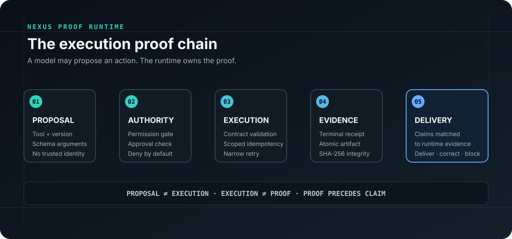

# Nexus Proof Runtime

**A receipt-backed execution and artifact-evidence layer for LLM tools.**

Models can propose actions. This runtime decides whether an action is authorized, executes a
versioned tool contract, records what happened, verifies produced artifacts, and checks claims
against evidence before an application presents them as fact.

This is a standalone public reference project by **Christopher Campbell**. It contains no Nexus
Synapse production source, memory implementation, SSR selection logic, prompts, identity system,
live schemas, provider configuration, or operational data.



## Why it exists

LLM applications often collapse proposal, execution, and narration into one blurry step. That
makes it easy for a model to claim a tool succeeded or a file exists when the host application has
no durable proof.

Nexus Proof Runtime separates those responsibilities:

1. The host supplies a trusted principal and scope.
2. The registry exposes only permitted, enabled tool versions.
3. Policy and approval checks run before handler invocation.
4. JSON Schema validates inputs and outputs.
5. The executor binds idempotency to identity, scope, tool version, and argument hash.
6. Every terminal outcome receives a runtime-owned receipt.
7. Artifacts are written atomically and verified by SHA-256.
8. Structured response claims are checked against receipts and artifact bytes.

## Quick start

```bash
python -m venv .venv
source .venv/bin/activate
python -m pip install -e ".[dev]"
pytest
nexus-proof-demo
```

Windows PowerShell:

```powershell
py -m venv .venv
.\.venv\Scripts\Activate.ps1
py -m pip install -e ".[dev]"
pytest
nexus-proof-demo
```

The demo creates a Markdown artifact, emits an execution receipt, verifies the file hash, and
checks both claims without calling an external model.

## Guarantees demonstrated

- Deny-by-default permissions and explicit approvals
- Trusted host identity that model arguments cannot override
- Versioned manifests and dispatch
- Draft 2020-12 JSON Schema validation
- Scoped, argument-bound idempotent replay
- Declared retryability instead of catching every failure
- Pre-start and cooperative in-flight cancellation
- Timeout signaling through the same cooperative token
- Terminal execution receipts
- Atomic artifact writes and SHA-256 tamper detection
- Receipt-backed tool-success and artifact-existence claims
- Capability-aware provider fallback that preserves tool context
- Offline deterministic tests

## Honest boundaries

This is an execution/evidence kernel, not a complete agent framework. It does not include:

- planning or autonomous loops;
- memory, retrieval, personalization, identity, or prompt construction;
- production authentication or network isolation;
- distributed queues or multi-node transaction coordination;
- forced termination of arbitrary Python code.

Python handlers must honor the cooperative cancellation token. Untrusted or non-cooperative tools
should run in a separate worker/container whose process can be terminated by the host.

See [Architecture](docs/ARCHITECTURE.md), [Security and scope](SECURITY.md), and
[Public boundary](docs/PUBLIC_BOUNDARY.md).

## Visual maps

- [Execution proof chain](docs/assets/execution-proof-chain.svg)
- [Trust boundary](docs/assets/trust-boundary.svg)

## Status

`0.1.0` is a reference release candidate. Its tests demonstrate behavior; they are not a
third-party security audit or a production certification.

## License

Apache License 2.0. See `LICENSE`.
