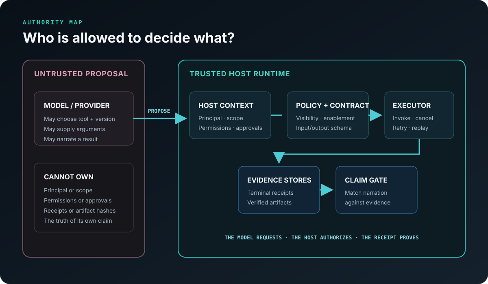

# Architecture

## Trust boundary

The model may supply only a tool name, version, and schema-valid arguments. The host application
owns the principal, scope, permissions, approvals, cancellation token, receipts, and artifacts.



| Component | Responsibility | Does not decide |
|---|---|---|
| `ToolRegistry` | Versioned manifest/handler lookup and visibility | Whether a result is true |
| `PolicyEngine` | Permissions, enablement, approvals | Model intent |
| `ToolExecutor` | Validation, retry, timeout signal, idempotency, terminal recording | User identity |
| `ReceiptStore` | Durable execution evidence | Natural-language claims |
| `ArtifactStore` | Atomic bytes, metadata, SHA-256 verification | Whether content is good |
| `ClaimGate` | Match structured claims to runtime evidence | Rewrite model prose |
| `ProviderGateway` | Capability filtering and narrow fallback | Tool authorization |

## Execution order

1. Resolve an exact tool version.
2. Evaluate host-owned permissions and approvals.
3. Validate model-authored arguments.
4. Hash canonical arguments and look for an exactly scoped replay.
5. Invoke the handler with trusted context.
6. Validate the handler output.
7. Record a terminal receipt and execution record.
8. Verify any artifact bytes before accepting an artifact claim.

The order is intentionally small and generic. It is not a description of the Nexus Synapse
conversation runtime.

## Idempotency identity

An idempotency replay requires an exact match on:

```text
key + principal + scope + tool name + tool version + canonical argument hash
```

Reusing a caller-provided key with different arguments does not replay an unrelated result.

## Failure semantics

Only `ToolRuntimeError(retryable=True)` or a code explicitly listed in a manifest may retry.
Unexpected programming errors terminate the execution as failed. Provider fallback similarly
catches only `RetryableProviderError`, so application bugs are not silently reclassified as
provider outages.
